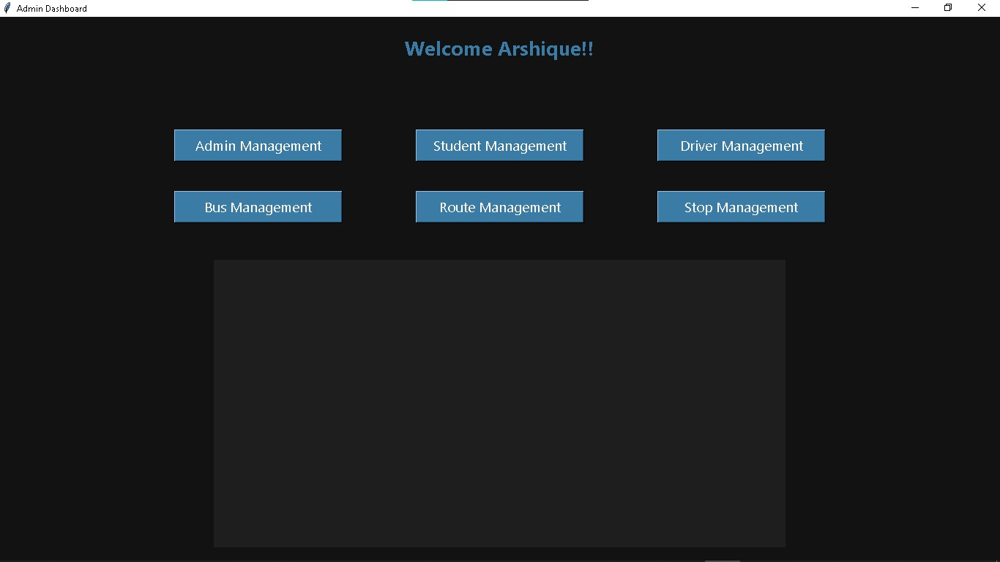

# School Bus Optimizer

**Route Wizard v1.0** is a Python-based desktop application designed to help schools manage buses, drivers, routes, and stops efficiently. It features a user-friendly **Tkinter GUI**, **MySQL database integration**, and **route optimization with map visualization**.

---

## Features

* **Admin Login:** Secure login system with role-based access.
* **Manage Entities:** Add, edit, and delete:

  * Admins
  * Students
  * Drivers
  * Buses
  * Routes
  * Stops
* **Inline Editing:** Edit table entries directly in the GUI.
* **Route Optimization:** Automatically calculates the most efficient route for a bus using the **nearest-neighbor algorithm**.
* **Map Visualization:** Optimized routes are plotted on an interactive **Folium map** for easy visualization.

---

## Technologies Used

* **Python 3**
* **Tkinter** for GUI
* **MySQL** for database
* **Folium** for interactive maps
* **Webbrowser** module to display maps
* **Math** module for route calculations

---

## Setup Instructions

1. **Clone the repository**

   ```bash
   git clone https://github.com/Arshique/SchoolBusOptimizer.git
   ```

2. **Install required packages**

   ```bash
   pip install mysql-connector-python folium
   ```

3. **Setup MySQL Database**

   * Run the SQL script `database.sql` included in this repository to create the database and tables.

4. **Run the Application**

   ```bash
   python main.py
   ```

5. **Login**

   * Use the default admin credentials you insert in the database.

---

## How It Works

* The system connects to a MySQL database to fetch and store data.
* Users can perform CRUD operations on all school entities.
* Clicking **Optimize Route** fetches all stops from the database and calculates the shortest route starting and ending at the school.
* The optimized route is displayed on a map with markers for each stop.

---

## Project Structure

```
SchoolBusOptimizer/
│
├─ main.py           # Main application file
├─ database.sql      # SQL script to create database and tables
├─ optimized_route.html  # Generated map file
└─ README.md
```

---

## Screenshots

**Login Page:**


**Dashboard:**



**Optimized Route Map:**


---

## Author

**Arshique Alam**
GitHub: [https://github.com/Arshique](https://github.com/Arshique)

---

## License

This project is for educational purposes.

